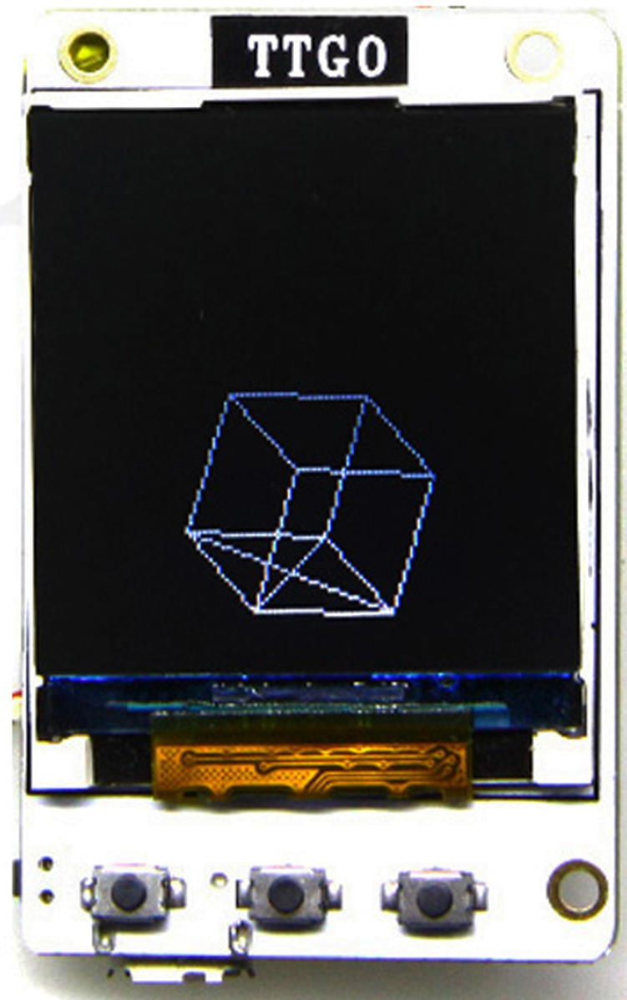

# TTGO TS v1.2 (1.44 TFT)

TTGO TS v1.2
ESP32, 1.44″ TFT, ลำโพง, MPU9250, 4 MB Flash, SD Card Slot, LiPo Battery Charger
เป็นบอร์ด ESP32 หน่วยความจำ 4 MB พร้อมจอภาพ TFT ขนาด 1.44 นิ้ว, MPU9250 (9 Axis MEMS Sensor ประกอบด้วย 3-axis gyroscope, 3-axis accelerometer, และ 3-axis magnetometer), ลำโพง, SD Card Reader และวงจรชาร์จแบตเตอรี่ (LiPo)

สั่งซื้อ : https://thai-maker.com/product/ttgo-ts-v12-144/

